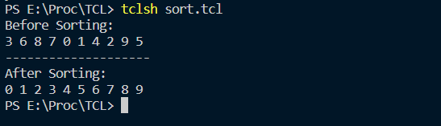
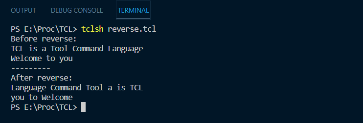

# Tcl Procedures
## Simple Tcl scripts to sort and manipulate data
## Getting Started
### Prerequisites
* Tcl 8.6

### First script: sort.tcl
This script has a procedure that sorts a list of numbers in ascending order. It uses the merge sort algorithm. The script is called with the following command:
```
tclsh sort.tcl
```
### Example result:



### Second script: reverse.tcl

This script has a procedure that reverses a sentence. The script is called with the following command:
```
tclsh reverse.tcl
```
### Example result:

